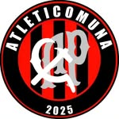
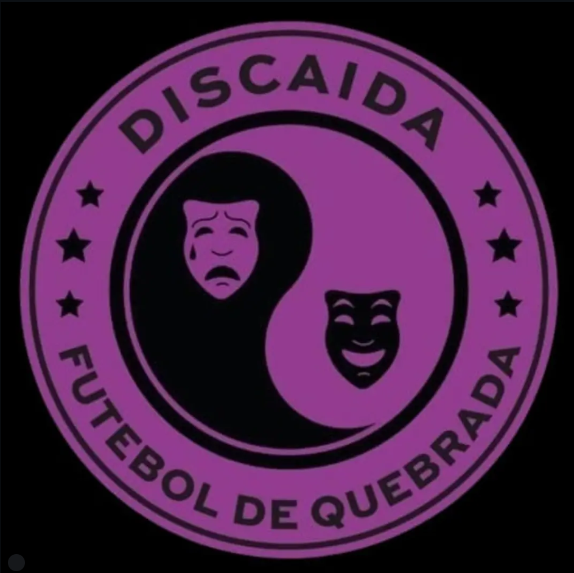
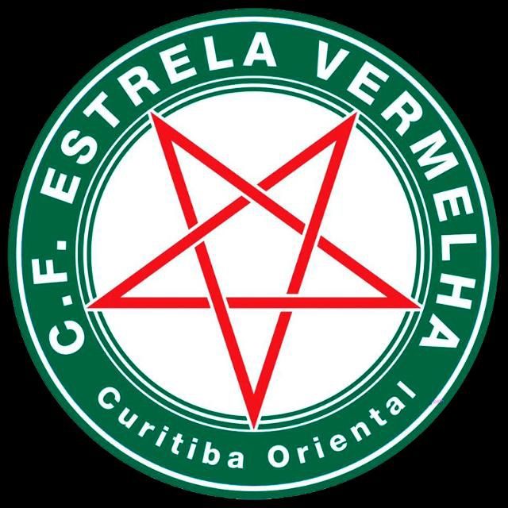
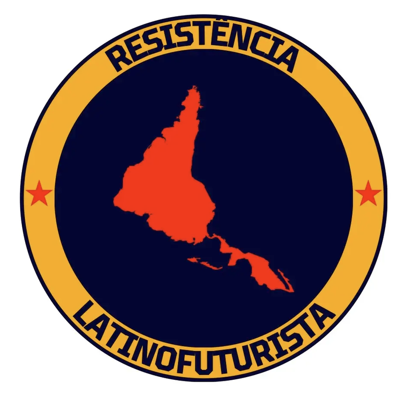
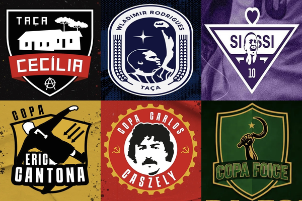

# Liga de Futebol Antifascista (LFA)

<table align="right" width="280" style="margin-left: 20px; margin-bottom: 20px; border: 1px solid #d8dee4; border-collapse: collapse; font-family: sans-serif;">
  <thead>
    <tr style="background-color: #f6f8fa;">
      <th colspan="2" style="padding: 10px; border: 1px solid #d8dee4; text-align: center; font-size: 1.1em;">Liga de Futebol Antifascista (LFA)</th>
    </tr>
  </thead>
  <tbody>
    <tr>
      <td colspan="2" align="center" style="text-align: center; padding: 15px; border: 1px solid #d8dee4; background-color: #ffffff;">
        
      </td>
    </tr>
    <tr>
      <td style="padding: 8px; border: 1px solid #d8dee4; font-weight: bold; background-color: #f6f8fa; width: 35%;">Tipo</td>
      <td style="padding: 8px; border: 1px solid #d8dee4; background-color: #ffffff;">Liga de futebol amador (Fut7)</td>
    </tr>
    <tr>
      <td style="padding: 8px; border: 1px solid #d8dee4; font-weight: bold; background-color: #f6f8fa;">Fundação</td>
      <td style="padding: 8px; border: 1px solid #d8dee4; background-color: #ffffff;">2022</td>
    </tr>
    <tr>
      <td style="padding: 8px; border: 1px solid #d8dee4; font-weight: bold; background-color: #f6f8fa;">Sede</td>
      <td style="padding: 8px; border: 1px solid #d8dee4; background-color: #ffffff;">Curitiba, Paraná, Brasil</td>
    </tr>
    <tr>
      <td style="padding: 8px; border: 1px solid #d8dee4; font-weight: bold; background-color: #f6f8fa;">Lema</td>
      <td style="padding: 8px; border: 1px solid #d8dee4; background-color: #ffffff;">Paz entre nós, guerra aos senhores</td>
    </tr>
  </tbody>
</table>

A **Liga de Futebol Antifascista (LFA)** foi criada com o objetivo de reunir diferentes setores da classe trabalhadora em torno da prática do futebol de 7. Defendendo os valores do Socialismo e da camaradagem, a LFA tem o intuito de construir um ambiente agradável para a prática do desporto mais popular do Brasil, zelando não só para a prática do futebol, mas também para unir pessoas e times de forma plural com base no respeito dentro e fora de campo.

As equipes reunidas em nossa Liga têm consciência do período de retrocesso representado pelos governos de Bolsonaro e Ratinho Jr, uma vez que ambos atacam a educação, direitos trabalhistas e contribuem para a exclusão da juventude à cidadania e direitos como o acesso ao lazer e possibilidade de prática esportiva. Desta forma a Liga existe com objetivo inclusivo, para agregar nossa classe tão atacada pelo poder público, sem objetivos lucrativos ou de promoção pessoal ou coletiva.

Paz entre nós, guerra aos senhores.

**Para contribuir com esta wiki, clique [aqui](../README.md)**

---

<strong style="font-size: 1.5em;">Equipes</strong>

### Membros Ativos
*  [9-Dedos](./times/9-dedos.md)
*  [América de Calo](./times/america-de-calo.md)
*  [Aqui Estamos](./times/aqui-estamos.md)
*  [Atleticomuna](./times/atleticomuna.md)
*  [Azulão](./times/azulão.md)
*  [Brigada Lupicínia](./times/brigada-lupicinia.md)
*  [Deportivo Oriental](./times/deportivo-oriental.md)
*  [Diamante](./times/diamante.md)
*  [Discaída](./times/discaida.md)
*  [Estrela Vermelha](./times/Estrela-Vermelha.md)
*  [Imperial](./times/imperial.md)
*  [Latinofuturista](./times/latinofuturista.md)
*  [Liverpanças](./times/liverpancas.md)
*  [Locomotiva Makhnovista](./times/locomotiva-makhnovista.md)
*  [Paulo Freire](./times/paulo-freire.md)
*  [Primavera](./times/Primavera.md)
*  [Sankara](./times/sankara.md)
*  [Sem Fronteiras](./times/sem-fronteiras.md)
*  [Toque de Classe](./times/toque-de-classe.md)
*  [Umbabarauma](./times/umbabarauma.md)

### Membros Anteriores
*  [Baianos de Mauá](./times/baianos-de-maua.md)
*  [Bolchesitio](./times/bolchesitio.md)
*  [Caos da Villa](./times/caos-da-villa.md)
*  [Delas](./times/delas.md)
*  [Faixa Preta](./times/faixa-preta.md)
*  [Ginga](./times/ginga.md)
*  [Guairacá](./times/guairaca.md)
*  [IV:XX de Novembro](./times/IV:XX-de-Novembro.md)
*  [Linha Esquerda](./times/linha-esquerda.md)
*  [Matriarcado](./times/matriarcado.md)
*  [Matsubara](./times/matsubara.md)
*  [Pé de Pano](./times/pe-de-pano.md)
*  [Resistência Alviverde](./times/resistencia-alviverde.md)
*  [São Bento](./times/sao-bento.md)
*  [Teto Preto](./times/teto-preto.md)
*  [Zapatista](./times/zapatista.md)

---

<strong style="font-size: 1.5em;">Campeonatos</strong>

* [Taça Cecília](./campeonatos/taca-cecilia.md)
* [Taça Wladimir Rodrigues](./campeonatos/taca-wladimir-rodrigues.md)
* [Taça Sissi](./campeonatos/taca-sissi.md)
* [Supertaça](./campeonatos/supertaca.md)
* [Copa Eric Cantona](./campeonatos/copa-eric-cantona.md)
* [Copa Carlos Caszely](./campeonatos/copa-carlos-caszely.md)
* [Copa Foice](./campeonatos/copa-foice.md)
* [Recopa](./campeonatos/recopa.md)

  

---

<strong style="font-size: 1.5em;">Temporadas</strong>

### 2022
* [2022 Apertura](./temporadas/2022/apertura.md)
* [2022 Clausura](./temporadas/2022/clausura.md)

### 2023
* [2023 Apertura](./temporadas/2023/apertura.md)
* [2023 Clausura](./temporadas/2023/clausura.md)

### 2024
* [2024 Apertura](./temporadas/2024/apertura.md)
* [2024 Clausura](./temporadas/2024/clausura.md)

### 2025
* [2025 Apertura](./temporadas/2025/apertura.md)
* [2025 Clausura](./temporadas/2025/clausura.md)

### 2026
* [2026 Apertura](./temporadas/2026/apertura.md)
* [2026 Clausura](./temporadas/2026/clausura.md)

