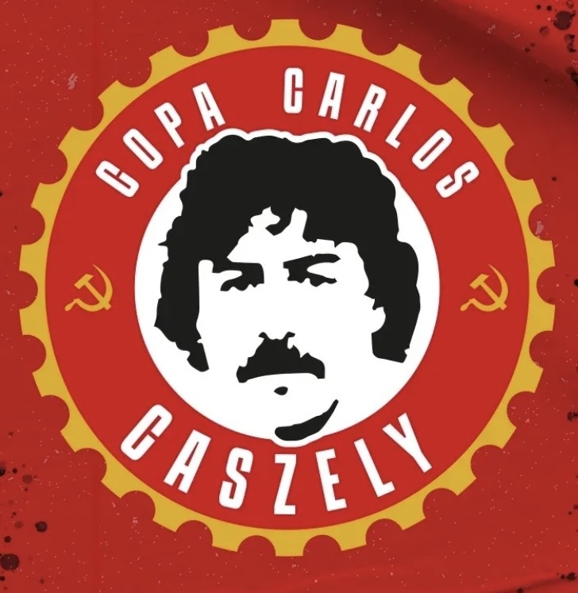

# Copa Carlos Caszely 2026 – Apertura

<table align="right" width="300" style="margin-left: 20px; margin-bottom: 20px; border: 1px solid #d8dee4; border-collapse: collapse; font-family: sans-serif;">
<thead>
<tr style="background-color: #f6f8fa;">
<th colspan="2" style="padding: 10px; border: 1px solid #d8dee4; text-align: center; font-size: 1.2em;">Copa Carlos Caszely 2026 <small>Apertura</small></th>
</tr>
</thead>
<tbody>
<tr>
<td colspan="2" align="center" style="text-align: center; padding: 15px; border: 1px solid #d8dee4; background-color: #ffffff;">

</td>
</tr>
<tr>
<td style="padding: 8px; border: 1px solid #d8dee4; font-weight: bold; background-color: #f6f8fa; width: 40%;">Campeão</td>
<td style="padding: 8px; border: 1px solid #d8dee4; background-color: #ffffff;"><b><a href="../../times/deportivo-oriental.md">Deportivo Oriental</a></b> (2º título)</td>
</tr>
<tr>
<td style="padding: 8px; border: 1px solid #d8dee4; font-weight: bold; background-color: #f6f8fa;">Vice-campeão</td>
<td style="padding: 8px; border: 1px solid #d8dee4; background-color: #ffffff;"><a href="../../times/umbabarauma.md">Umbabarauma</a></td>
</tr>
<tr>
<td style="padding: 8px; border: 1px solid #d8dee4; font-weight: bold; background-color: #f6f8fa;">Terceiro lugar</td>
<td style="padding: 8px; border: 1px solid #d8dee4; background-color: #ffffff;"><a href="../../times/liverpancas.md">Liverpanças FC</a></td>
</tr>
<tr>
<td style="padding: 8px; border: 1px solid #d8dee4; font-weight: bold; background-color: #f6f8fa;">Quarto lugar</td>
<td style="padding: 8px; border: 1px solid #d8dee4; background-color: #ffffff;"><a href="../../times/locomotiva-makhnovista.md">Locomotiva Makhnovista</a></td>
</tr>
<tr style="background-color: #f6f8fa;">
<th colspan="2" style="padding: 6px; border: 1px solid #d8dee4; text-align: center; font-size: 0.95em;">Estatísticas</th>
</tr>
<tr>
<td style="padding: 8px; border: 1px solid #d8dee4; font-weight: bold; background-color: #f6f8fa;">Partidas jogadas</td>
<td style="padding: 8px; border: 1px solid #d8dee4; background-color: #ffffff;">8</td>
</tr>
<tr>
<td style="padding: 8px; border: 1px solid #d8dee4; font-weight: bold; background-color: #f6f8fa;">Gols marcados</td>
<td style="padding: 8px; border: 1px solid #d8dee4; background-color: #ffffff;">29 (3.63 por partida)</td>
</tr>
<tr>
<td style="padding: 8px; border: 1px solid #d8dee4; font-weight: bold; background-color: #f6f8fa;">Artilheiro</td>
<td style="padding: 8px; border: 1px solid #d8dee4; background-color: #ffffff;">Tiago (3 gols)</td>
</tr>
</tbody>
</table>

A **Copa Carlos Caszely de 2026 – Apertura** foi a 9ª edição deste importante torneio de copa da LFA (Liga de Futebol Antifascista). O nome do campeonato homenageia Carlos Caszely, lendário jogador chileno conhecido por sua oposição pública à ditadura militar de Pinochet.

O **Deportivo Oriental** faturou o título ao derrotar o **Umbabarauma** por 4 a 1 na partida final, faturando o bicampeonato histórico.

## Fase Final

A Copa foi disputada em jogos de eliminação direta a partir das Quartas de Final.

<table border="0" cellpadding="0" cellspacing="0" style="border-collapse: collapse; width: 100%;">
<tr>
<th style="width: 30%; text-align: center; padding-bottom: 10px;">Quartas de Final</th>
<th style="width: 5%;"></th>
<th style="width: 30%; text-align: center; padding-bottom: 10px;">Semifinais</th>
<th style="width: 5%;"></th>
<th style="width: 30%; text-align: center; padding-bottom: 10px;">Final</th>
</tr>
<tr>
<td style="vertical-align: middle; padding: 10px;">
<table style="border: 1px solid #d8dee4; width: 100%; margin-bottom: 15px; border-collapse: collapse;">
<tr>
<td style="padding: 6px; border: 1px solid #d8dee4;"><a href="../../times/locomotiva-makhnovista.md"><b>Locomotiva Makhnovista</b></a></td>
<td style="padding: 6px; border: 1px solid #d8dee4; text-align: center; width: 45px; font-weight: bold;">2</td>
</tr>
<tr>
<td style="padding: 6px; border: 1px solid #d8dee4;"><a href="../../times/guairaca.md">Guairacá Futebol Ancestral</a></td>
<td style="padding: 6px; border: 1px solid #d8dee4; text-align: center; width: 45px;">1</td>
</tr>
</table>
<table style="border: 1px solid #d8dee4; width: 100%; margin-bottom: 15px; border-collapse: collapse;">
<tr>
<td style="padding: 6px; border: 1px solid #d8dee4;"><a href="../../times/brigada-lupicinia.md">Brigada Lupicínia F.C.</a></td>
<td style="padding: 6px; border: 1px solid #d8dee4; text-align: center; width: 45px;">1</td>
</tr>
<tr>
<td style="padding: 6px; border: 1px solid #d8dee4;"><a href="../../times/deportivo-oriental.md"><b>Deportivo Oriental</b></a></td>
<td style="padding: 6px; border: 1px solid #d8dee4; text-align: center; width: 45px; font-weight: bold;">1 (p)</td>
</tr>
</table>
<table style="border: 1px solid #d8dee4; width: 100%; margin-bottom: 15px; border-collapse: collapse;">
<tr>
<td style="padding: 6px; border: 1px solid #d8dee4;"><a href="../../times/toque-de-classe.md">Toque de Classe</a></td>
<td style="padding: 6px; border: 1px solid #d8dee4; text-align: center; width: 45px;">0</td>
</tr>
<tr>
<td style="padding: 6px; border: 1px solid #d8dee4;"><a href="../../times/liverpancas.md"><b>Liverpanças FC</b></a></td>
<td style="padding: 6px; border: 1px solid #d8dee4; text-align: center; width: 45px; font-weight: bold;">1</td>
</tr>
</table>
<table style="border: 1px solid #d8dee4; width: 100%; border-collapse: collapse;">
<tr>
<td style="padding: 6px; border: 1px solid #d8dee4;"><a href="../../times/Primavera.md">Primavera F.C.</a></td>
<td style="padding: 6px; border: 1px solid #d8dee4; text-align: center; width: 45px;">1</td>
</tr>
<tr>
<td style="padding: 6px; border: 1px solid #d8dee4;"><a href="../../times/umbabarauma.md"><b>Umbabarauma</b></a></td>
<td style="padding: 6px; border: 1px solid #d8dee4; text-align: center; width: 45px; font-weight: bold;">3</td>
</tr>
</table>
</td>
<td></td>
<td style="vertical-align: middle; padding: 10px;">
<table style="border: 1px solid #d8dee4; width: 100%; margin-bottom: 60px; border-collapse: collapse;">
<tr>
<td style="padding: 8px; border: 1px solid #d8dee4;"><a href="../../times/locomotiva-makhnovista.md">Locomotiva Makhnovista</a></td>
<td style="padding: 8px; border: 1px solid #d8dee4; text-align: center; width: 40px;">1</td>
</tr>
<tr>
<td style="padding: 8px; border: 1px solid #d8dee4;"><a href="../../times/deportivo-oriental.md"><b>Deportivo Oriental</b></a></td>
<td style="padding: 8px; border: 1px solid #d8dee4; text-align: center; width: 40px; font-weight: bold;">2</td>
</tr>
</table>
<table style="border: 1px solid #d8dee4; width: 100%; border-collapse: collapse;">
<tr>
<td style="padding: 8px; border: 1px solid #d8dee4;"><a href="../../times/liverpancas.md">Liverpanças FC</a></td>
<td style="padding: 8px; border: 1px solid #d8dee4; text-align: center; width: 40px;">1</td>
</tr>
<tr>
<td style="padding: 8px; border: 1px solid #d8dee4;"><a href="../../times/umbabarauma.md"><b>Umbabarauma</b></a></td>
<td style="padding: 8px; border: 1px solid #d8dee4; text-align: center; width: 40px; font-weight: bold;">1 (p)</td>
</tr>
</table>
</td>
<td></td>
<td style="vertical-align: middle; padding: 10px;">
<table style="border: 2px solid #333; width: 100%; border-collapse: collapse;">
<tr style="background-color: #f6f8fa;">
<th colspan="2" style="padding: 10px; text-align: center; border-bottom: 2px solid #333;">FINAL</th>
</tr>
<tr>
<td style="padding: 8px; border: 1px solid #d8dee4;"><a href="../../times/deportivo-oriental.md"><b>Deportivo Oriental</b></a></td>
<td style="padding: 8px; border: 1px solid #d8dee4; text-align: center; width: 40px; font-weight: bold; background-color: #e6ffec;">4</td>
</tr>
<tr>
<td style="padding: 8px; border: 1px solid #d8dee4;"><a href="../../times/umbabarauma.md">Umbabarauma</a></td>
<td style="padding: 8px; border: 1px solid #d8dee4; text-align: center; width: 40px;">1</td>
</tr>
</table>
</td>
</tr>
</table>

<h3>Disputa pelo 3º lugar</h3>
<table style="border: 1px solid #d8dee4; width: 320px; border-collapse: collapse; margin-top: 15px;">
<tr>
<td style="padding: 8px; border: 1px solid #d8dee4; font-weight: bold; background-color: #e6ffec;"><a href="../../times/liverpancas.md"><b>Liverpanças FC</b></a></td>
<td style="padding: 8px; border: 1px solid #d8dee4; text-align: center; width: 40px; font-weight: bold;">8</td>
</tr>
<tr>
<td style="padding: 8px; border: 1px solid #d8dee4;"><a href="../../times/locomotiva-makhnovista.md">Locomotiva Makhnovista</a></td>
<td style="padding: 8px; border: 1px solid #d8dee4; text-align: center; width: 40px;">1</td>
</tr>
</table>

### Detalhes dos Confrontos

* **Quartas de Final 1**: **Locomotiva Makhnovista** 2–1 Guairacá Futebol Ancestral
* **Quartas de Final 2**: Brigada Lupicínia F.C. 1–1 **Deportivo Oriental** (Deportivo Oriental avançou nos pênaltis)
* **Quartas de Final 3**: Toque de Classe 0–1 **Liverpanças FC**
* **Quartas de Final 4**: Primavera F.C. 1–3 **Umbabarauma**
* **Semifinal 1**: Locomotiva Makhnovista 1–2 **Deportivo Oriental**
* **Semifinal 2**: Liverpanças FC 1–1 **Umbabarauma** (Umbabarauma avançou nos pênaltis)
* **Disputa pelo 3º lugar**: **Liverpanças FC** 8–1 Locomotiva Makhnovista
* **Final**: **Deportivo Oriental** 4–1 Umbabarauma

## Artilharia

| Pos | Jogador | Equipe | Gols |
| :---: | :--- | :--- | :---: |
| 1 | Tiago | [Deportivo Oriental](../../times/deportivo-oriental.md) | 3 |
| 2 | C. Murilo | [Liverpanças FC](../../times/liverpancas.md) | 2 |
| 3 | Lemes | [Liverpanças FC](../../times/liverpancas.md) | 2 |
| 4 | Galileu | [Liverpanças FC](../../times/liverpancas.md) | 2 |
| 5 | Irakoze | [Umbabarauma](../../times/umbabarauma.md) | 2 |
| 6 | Chiquiti | [Liverpanças FC](../../times/liverpancas.md) | 1 |
| 7 | Renan Otah | [Umbabarauma](../../times/umbabarauma.md) | 1 |
| 8 | Titos Francisco Jairosse | [Umbabarauma](../../times/umbabarauma.md) | 1 |
| 9 | Lukas A | [Liverpanças FC](../../times/liverpancas.md) | 1 |
| 10 | Gustavo Adam | [Deportivo Oriental](../../times/deportivo-oriental.md) | 1 |
