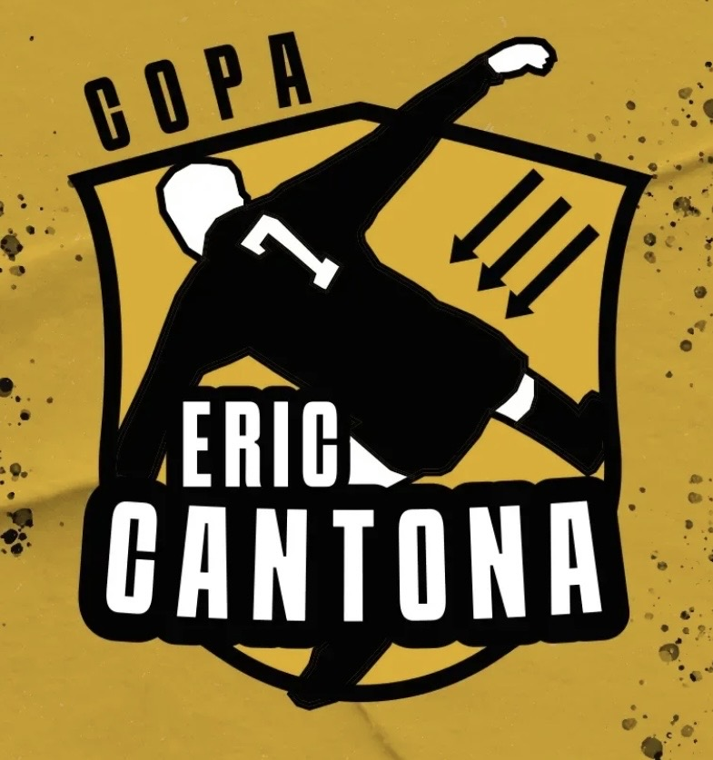

# Copa Eric Cantona

<table align="right" width="280" style="margin-left: 20px; margin-bottom: 20px; border: 1px solid #d8dee4; border-collapse: collapse; font-family: sans-serif;">
  <thead>
    <tr style="background-color: #f6f8fa;">
      <th colspan="2" style="padding: 10px; border: 1px solid #d8dee4; text-align: center; font-size: 1.1em;">Copa Eric Cantona</th>
    </tr>
  </thead>
  <tbody>
    <tr>
      <td colspan="2" align="center" style="text-align: center; padding: 15px; border: 1px solid #d8dee4; background-color: #ffffff;">
        
      </td>
    </tr>
    <tr>
      <td style="padding: 8px; border: 1px solid #d8dee4; font-weight: bold; background-color: #f6f8fa; width: 35%;">Organizador</td>
      <td style="padding: 8px; border: 1px solid #d8dee4; background-color: #ffffff;"><a href="../index.md">LFA</a></td>
    </tr>
    <tr>
      <td style="padding: 8px; border: 1px solid #d8dee4; font-weight: bold; background-color: #f6f8fa;">Tipo</td>
      <td style="padding: 8px; border: 1px solid #d8dee4; background-color: #ffffff;">Copa</td>
    </tr>
    <tr>
      <td style="padding: 8px; border: 1px solid #d8dee4; font-weight: bold; background-color: #f6f8fa;">Edições</td>
      <td style="padding: 8px; border: 1px solid #d8dee4; background-color: #ffffff;">9</td>
    </tr>
    <tr>
      <td style="padding: 8px; border: 1px solid #d8dee4; font-weight: bold; background-color: #f6f8fa;">Times</td>
      <td style="padding: 8px; border: 1px solid #d8dee4; background-color: #ffffff;">8</td>
    </tr>
    <tr>
      <td style="padding: 8px; border: 1px solid #d8dee4; font-weight: bold; background-color: #f6f8fa;">Primeiro vencedor</td>
      <td style="padding: 8px; border: 1px solid #d8dee4; background-color: #ffffff;"><a href="../times/resistencia-alviverde.md">Resistência</a> (<a href="../temporadas/2022/apertura.md">2022-A</a>)</td>
    </tr>
    <tr>
      <td style="padding: 8px; border: 1px solid #d8dee4; font-weight: bold; background-color: #f6f8fa;">Último vencedor</td>
      <td style="padding: 8px; border: 1px solid #d8dee4; background-color: #ffffff;"><a href="../times/Estrela-Vermelha.md">Estrela Vermelha</a> (<a href="./cantona/2026-apertura.md">2026-A</a>)</td>
    </tr>
    <tr>
      <td style="padding: 8px; border: 1px solid #d8dee4; font-weight: bold; background-color: #f6f8fa;">Maior vencedor</td>
      <td style="padding: 8px; border: 1px solid #d8dee4; background-color: #ffffff;"><a href="../times/Estrela-Vermelha.md">Estrela Vermelha</a> (4 títulos)</td>
    </tr>
  </tbody>
</table>

A **Copa Eric Cantona** é uma competição de futebol de 7 organizada pela LFA.

O nome do campeonato homenageia Eric Cantona, personalidade que não foi apenas um jogador de futebol; ele se tornou um verdadeiro símbolo de atitude e paixão dentro e fora dos campos. Com seu estilo irreverente, personalidade forte e habilidade inconfundível, conquistou os corações de milhões de fãs ao redor do mundo.

Cantona iniciou sua carreira na França, mas foi no Manchester United que sua lenda se consolidou. Chegando ao clube inglês em 1992, ele imediatamente se destacou, sendo um dos responsáveis pela revolução que levou o United a conquistar uma série de títulos, incluindo quatro campeonatos da Premier League e a histórica FA Cup de 1996. Sua presença em campo era única: um líder nato, com uma visão de jogo impressionante, passes geniais e gols inesquecíveis.

Futebolista, ator e diretor, Cantona é um artista em todas as funções que passou. Em campo Cantona faz parte de um seleto grupo de ídolos do Manchester United, além de outros clubes de Inglaterra e França. O craque também defendeu a seleção francesa, não chegou a participar da Copa do Mundo, mas ostenta números invejáveis e títulos expressivos. Cantona deixou os gramados cedo, aos 30 anos, e um legado de rebeldia simbolizado pela famosa voadora no torcedor que preferiu a ele gritos xenófobos, episódio inclusive que o mesmo já afirmou em diversas ocasiões que não se arrepende em absolutamente nada, a não ser poder ter sido mais forte.

Grande crítico abertamente a grupos de extrema direita, também fez duras críticas a Deschamps, então treinador da seleção francesa, o acusando de racismo nas não convocações de Benzema e Hatem Ben Arfa, ambos de origem africana, em 2016. O então ex-jogador sempre defendeu a imigração e as causas sociais. Em 2012, chegou a anunciar que concorreria à presidência da França, porém foi mais uma jogada do craque para chamar a atenção para a falta de moradia aos mais pobres.

Em suma, Eric Cantona como jogador, artista e ativista é um cara que nos inspira, uma figura que merece todo o respeito dentro e fora dos gramados, por essa razão nomeamos nossa Copa em sua homenagem. Este campeonato em sua homenagem é uma forma de reconhecer não apenas o grande jogador que foi, mas também a inspiração que Cantona deixou para as futuras gerações de atletas e fãs. Ele mostrou que, no futebol, o talento pode ser acompanhado de uma personalidade marcante, que não teme se destacar e fazer história.

Nossa Copa representa a importância de jogar com coração, coragem e, acima de tudo, sem esquecer das mazelas trazidas pelo capitalismo.

Eric Cantona, presente!
Paz entre nós, guerra aos senhores!

## Formato

A competição é disputada em formato de mata-mata pelas equipes que terminam no **top 8 da Taça Cecília** na temporada correspondente.

## Histórico

| Ed. | Campeão | Placar | Vice | Terceiro | Placar | Quarto |
| :--- | :--- | :--- | :--- | :--- | :--- | :--- |
| [2022-A](../temporadas/2022/apertura.md) | **[Resistência](../times/resistencia-alviverde.md)** | 7x5 | [Pé-de-pano](../times/pe-de-pano.md) | [Estrela Vermelha](../times/Estrela-Vermelha.md) | WO | [Primavera](../times/Primavera.md) |
| [2022-C](../temporadas/2022/clausura.md) | **[Resistência](../times/resistencia-alviverde.md)** | 3x3 <small>(2x0 p)</small> | [Estrela Vermelha](../times/Estrela-Vermelha.md) | [Pé-de-pano](../times/pe-de-pano.md) | 4x4 <small>(3x2 p)</small> | [Locomotiva](../times/locomotiva-makhnovista.md) |
| [2023-A](../temporadas/2023/apertura.md) | **[Locomotiva](../times/locomotiva-makhnovista.md)** | 1x1 <small>(2x1 p)</small> | [Estrela Vermelha](../times/Estrela-Vermelha.md) | [Umbabarauma](../times/umbabarauma.md) | 2x2 <small>(3x2 p)</small> | [Guairacá](../times/guairaca.md) |
| [2023-C](../temporadas/2023/clausura.md) | **[Pé-de-pano](../times/pe-de-pano.md)** | 4x4 <small>(3x1 p)</small> | [9Dedos](../times/9-dedos.md) | [Locomotiva](../times/locomotiva-makhnovista.md) | 4x3 | [Umbabarauma](../times/umbabarauma.md) |
| [2024-A](../temporadas/2024/apertura.md) | **[Estrela Vermelha](../times/Estrela-Vermelha.md)** | 4x2 | [Guairacá](../times/guairaca.md) | [Deportivo Oriental](../times/deportivo-oriental.md) | 4x4 <small>(2x0 p)</small> | [Sankara](../times/sankara.md) |
| [2024-C](../temporadas/2024/clausura.md) | **[Estrela Vermelha](../times/Estrela-Vermelha.md)** | 4x3 | [Teto Preto](../times/teto-preto.md) | [Pé-de-pano](../times/pe-de-pano.md) | WO | [Aqui Estamos](../times/aqui-estamos.md) |
| [2025-A](./cantona/2025-apertura.md) | **[Estrela Vermelha](../times/Estrela-Vermelha.md)** | 5x3 | [9Dedos](../times/9-dedos.md) | [Imperial](../times/imperial.md) | 8x6 | [Primavera](../times/Primavera.md) |
| [2025-C](./cantona/2025-clausura.md) | **[Imperial](../times/imperial.md)** | 2x1 | [Estrela Vermelha](../times/Estrela-Vermelha.md) | [Deportivo Oriental](../times/deportivo-oriental.md) | 2x1 | [Primavera](../times/Primavera.md) |
| [2026-A](./cantona/2026-apertura.md) | **[Estrela Vermelha](../times/Estrela-Vermelha.md)** | 5x2 | [Azulão](../times/azulão.md) | [América de Calo](../times/america-de-calo.md) | 6x2 | [Sankara](../times/sankara.md) |

## Desempenho por Equipe

| Equipe | Títulos | Vices | Terceiros | Quartos |
| :--- | :---: | :---: | :---: | :---: |
| [Estrela Vermelha](../times/Estrela-Vermelha.md) | 4 ([2024-A](../temporadas/2024/apertura.md), [2024-C](../temporadas/2024/clausura.md), [2025-A](./cantona/2025-apertura.md), [2026-A](./cantona/2026-apertura.md)) | 3 ([2022-C](../temporadas/2022/clausura.md), [2023-A](../temporadas/2023/apertura.md), [2025-C](./cantona/2025-clausura.md)) | 1 ([2022-A](../temporadas/2022/apertura.md)) | 0 |
| [Resistência](../times/resistencia-alviverde.md) | 2 ([2022-A](../temporadas/2022/apertura.md), [2022-C](../temporadas/2022/clausura.md)) | 0 | 0 | 0 |
| [Pé-de-pano](../times/pe-de-pano.md) | 1 ([2023-C](../temporadas/2023/clausura.md)) | 1 ([2022-A](../temporadas/2022/apertura.md)) | 2 ([2022-C](../temporadas/2022/clausura.md), [2024-C](../temporadas/2024/clausura.md)) | 0 |
| [Locomotiva](../times/locomotiva-makhnovista.md) | 1 ([2023-A](../temporadas/2023/apertura.md)) | 0 | 1 ([2023-C](../temporadas/2023/clausura.md)) | 1 ([2022-C](../temporadas/2022/clausura.md)) |
| [Imperial](../times/imperial.md) | 1 ([2025-C](./cantona/2025-clausura.md)) | 0 | 1 ([2025-A](./cantona/2025-apertura.md)) | 0 |
| [9Dedos](../times/9-dedos.md) | 0 | 2 ([2023-C](../temporadas/2023/clausura.md), [2025-A](./cantona/2025-apertura.md)) | 0 | 0 |
| [Guairacá](../times/guairaca.md) | 0 | 1 ([2024-A](../temporadas/2024/apertura.md)) | 0 | 1 ([2023-A](../temporadas/2023/apertura.md)) |
| [Azulão](../times/azulão.md) | 0 | 1 ([2026-A](./cantona/2026-apertura.md)) | 0 | 0 |
| [Teto Preto](../times/teto-preto.md) | 0 | 1 ([2024-C](../temporadas/2024/clausura.md)) | 0 | 0 |
| [Deportivo Oriental](../times/deportivo-oriental.md) | 0 | 0 | 2 ([2024-A](../temporadas/2024/apertura.md), [2025-C](./cantona/2025-clausura.md)) | 0 |
| [Umbabarauma](../times/umbabarauma.md) | 0 | 0 | 1 ([2023-A](../temporadas/2023/apertura.md)) | 1 ([2023-C](../temporadas/2023/clausura.md)) |
| [América de Calo](../times/america-de-calo.md) | 0 | 0 | 1 ([2026-A](./cantona/2026-apertura.md)) | 0 |
| [Primavera](../times/Primavera.md) | 0 | 0 | 0 | 3 ([2022-A](../temporadas/2022/apertura.md), [2025-A](./cantona/2025-apertura.md), [2025-C](./cantona/2025-clausura.md)) |
| [Sankara](../times/sankara.md) | 0 | 0 | 0 | 2 ([2024-A](../temporadas/2024/apertura.md), [2026-A](./cantona/2026-apertura.md)) |
| [Aqui Estamos](../times/aqui-estamos.md) | 0 | 0 | 0 | 1 ([2024-C](../temporadas/2024/clausura.md)) |
