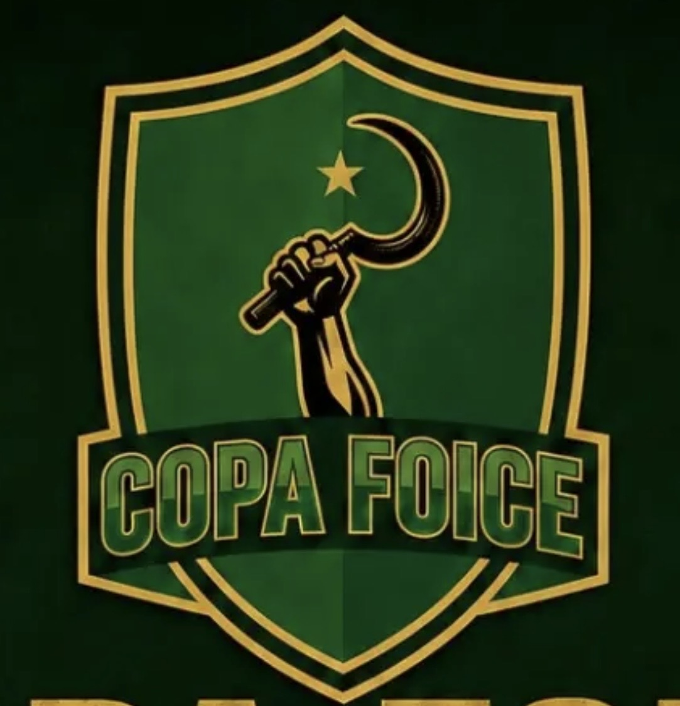

# Copa Foice

<table align="right" width="280" style="margin-left: 20px; margin-bottom: 20px; border: 1px solid #d8dee4; border-collapse: collapse; font-family: sans-serif;">
  <thead>
    <tr style="background-color: #f6f8fa;">
      <th colspan="2" style="padding: 10px; border: 1px solid #d8dee4; text-align: center; font-size: 1.1em;">Copa Foice</th>
    </tr>
  </thead>
  <tbody>
    <tr>
      <td colspan="2" align="center" style="text-align: center; padding: 15px; border: 1px solid #d8dee4; background-color: #ffffff;">
        
      </td>
    </tr>
    <tr>
      <td style="padding: 8px; border: 1px solid #d8dee4; font-weight: bold; background-color: #f6f8fa;">Tipo</td>
      <td style="padding: 8px; border: 1px solid #d8dee4; background-color: #ffffff;">Copa / Torneio LFA</td>
    </tr>
  </tbody>
</table>

A **Copa Foice** é uma competição da LFA.

Paz entre nós, guerra aos senhores!

## Histórico

| Ed. | Campeão | Placar | Vice | Terceiro | Placar | Quarto |
| :--- | :--- | :--- | :--- | :--- | :--- | :--- |
| [2026-A](./foice/2026-apertura.md) | **[Paulo Freire](../times/paulo-freire.md)** | 2x0 | [Zapatista](../times/zapatista.md) | [Baianos de Mauá](../times/baianos-de-maua.md) | WO | [Caos da Villa](../times/caos-da-villa.md) |

## Desempenho por Equipe

| Equipe | Títulos | Vices | Terceiros | Quartos |
| :--- | :---: | :---: | :---: | :---: |
| [Paulo Freire](../times/paulo-freire.md) | 1 ([2026-A](./foice/2026-apertura.md)) | 0 | 0 | 0 |
| [Zapatista](../times/zapatista.md) | 0 | 1 ([2026-A](./foice/2026-apertura.md)) | 0 | 0 |
| [Baianos de Mauá](../times/baianos-de-maua.md) | 0 | 0 | 1 ([2026-A](./foice/2026-apertura.md)) | 0 |
| [Caos da Villa](../times/caos-da-villa.md) | 0 | 0 | 0 | 1 ([2026-A](./foice/2026-apertura.md)) |
