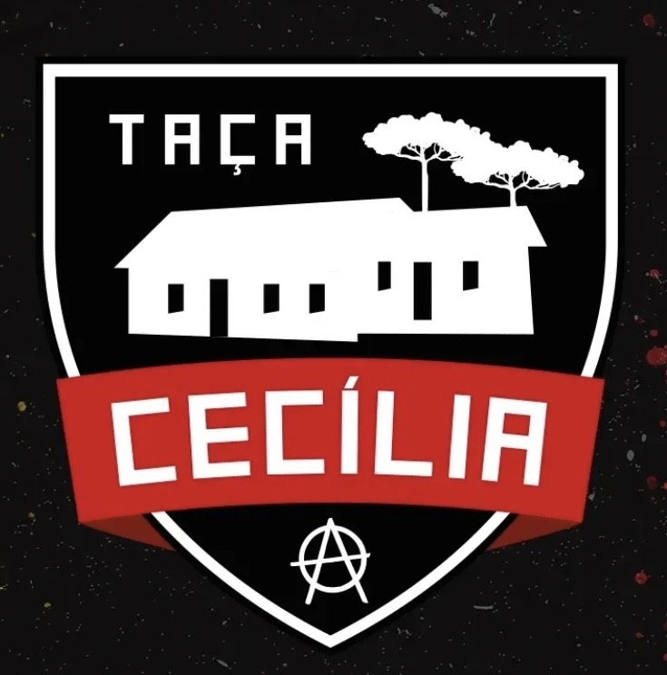

# Taça Cecília

<table align="right" width="280" style="margin-left: 20px; margin-bottom: 20px; border: 1px solid #d8dee4; border-collapse: collapse; font-family: sans-serif;">
  <thead>
    <tr style="background-color: #f6f8fa;">
      <th colspan="2" style="padding: 10px; border: 1px solid #d8dee4; text-align: center; font-size: 1.1em;">Taça Cecília</th>
    </tr>
  </thead>
  <tbody>
    <tr>
      <td colspan="2" align="center" style="text-align: center; padding: 15px; border: 1px solid #d8dee4; background-color: #ffffff;">
        
      </td>
    </tr>
    <tr>
      <td style="padding: 8px; border: 1px solid #d8dee4; font-weight: bold; background-color: #f6f8fa;">Tipo</td>
      <td style="padding: 8px; border: 1px solid #d8dee4; background-color: #ffffff;">Primeira Divisão</td>
    </tr>
  </tbody>
</table>

A **Taça Cecília** é o campeonato de primeira divisão da [LFA](../Home.md). O nome homenageia a **Colônia Cecília**, uma comuna experimental baseada em premissas anarquistas fundada em 1890 no município de Palmeira, Paraná, por um grupo de libertários mobilizados pelo escritor e agrônomo italiano Giovanni Rossi (1859-1943).

A fundação da Colônia Cecília foi a primeira tentativa efetiva de implantação do ideário anarquista no Brasil. Rossi, ideólogo e escritor anarquista, adepto da "acracia", foi instigado pelo músico brasileiro Carlos Gomes a procurar D. Pedro II com o propósito de instaurar uma comunidade capaz de propulsionar um "novo tempo", uma utopia baseada no trabalho, na vida e no amor libertário. A Taça Cecília celebra esses valores de cooperação, solidariedade e liberdade nos gramados.

Paz entre nós, guerra aos senhores!

## Formato

O campeonato é disputado no sistema de **pontos corridos** na fase inicial. Ao término dessa fase:
* Os **4 melhores colocados** se classificam para a fase eliminatória (**mata-mata**) para decidir o campeão.
* Os **2 últimos colocados** são rebaixados para a [Taça Wladimir Rodrigues](./taca-wladimir-rodrigues.md).

## Histórico

| Ed. | Campeão | Placar | Vice | Terceiro | Placar | Quarto |
| :--- | :--- | :--- | :--- | :--- | :--- | :--- |
| [2022-A](../temporadas/2022/apertura.md) | **[Pé-de-pano](../times/pe-de-pano.md)** | 5x1 | [Estrela Vermelha](../times/Estrela-Vermelha.md) | [Teto Preto](../times/teto-preto.md) | 7x4 | [Locomotiva](../times/locomotiva-makhnovista.md) |
| [2022-C](../temporadas/2022/clausura.md) | **[Pé-de-pano](../times/pe-de-pano.md)** | 6x1 | [Estrela Vermelha](../times/Estrela-Vermelha.md) | [Resistência](../times/resistencia-alviverde.md) | 5x3 | [Sankara](../times/sankara.md) |
| [2023-A](../temporadas/2023/apertura.md) | **[Guairacá](../times/guairaca.md)** | 4x2 | [Primavera](../times/Primavera.md) | [Estrela Vermelha](../times/Estrela-Vermelha.md) | 2x0 | [Umbabarauma](../times/umbabarauma.md) |
| [2023-C](../temporadas/2023/clausura.md) | **[Guairacá](../times/guairaca.md)** | 6x2 | [Pé-de-pano](../times/pe-de-pano.md) | [Sankara](../times/sankara.md) | 5x3 | [Locomotiva](../times/locomotiva-makhnovista.md) |
| [2024-A](../temporadas/2024/apertura.md) | **[Guairacá](../times/guairaca.md)** | 4x1 | [9Dedos](../times/9-dedos.md) | [Estrela Vermelha](../times/Estrela-Vermelha.md) | 5x2 | [Deportivo Oriental](../times/deportivo-oriental.md) |
| [2024-C](../temporadas/2024/clausura.md) | **[Guairacá](../times/guairaca.md)** | 5x4 | [Teto Preto](../times/teto-preto.md) | [Umbabarauma](../times/umbabarauma.md) | 4x2 | [Estrela Vermelha](../times/Estrela-Vermelha.md) |
| [2025-A](./cecilia/2025-apertura.md) | **[Pé-de-pano](../times/pe-de-pano.md)** | 2x2 <small>(4x3 p)</small> | [9Dedos](../times/9-dedos.md) | [Estrela Vermelha](../times/Estrela-Vermelha.md) | 4x1 | [Guairacá](../times/guairaca.md) |
| [2025-C](./cecilia/2025-clausura.md) | **[Imperial](../times/imperial.md)** | 2x2 <small>(11x10 p)</small> | [Estrela Vermelha](../times/Estrela-Vermelha.md) | [Deportivo Oriental](../times/deportivo-oriental.md) | 1x1 <small>(3x1 p)</small> | [Sankara](../times/sankara.md) |
| [2026-A](./cecilia/2026-apertura.md) | **[Sankara](../times/sankara.md)** | 3x2 | [Estrela Vermelha](../times/Estrela-Vermelha.md) | [América de Calo](../times/america-de-calo.md) | 4x0 | [Linha Esquerda](../times/linha-esquerda.md) |

## Desempenho por Equipe

| Equipe | Títulos | Vices | Terceiros | Quartos |
| :--- | :---: | :---: | :---: | :---: |
| [Guairacá](../times/guairaca.md) | 4 ([2023-A](../temporadas/2023/apertura.md), [2023-C](../temporadas/2023/clausura.md), [2024-A](../temporadas/2024/apertura.md), [2024-C](../temporadas/2024/clausura.md)) | 0 | 0 | 1 ([2025-A](./cecilia/2025-apertura.md)) |
| [Pé-de-pano](../times/pe-de-pano.md) | 3 ([2022-A](../temporadas/2022/apertura.md), [2022-C](../temporadas/2022/clausura.md), [2025-A](./cecilia/2025-apertura.md)) | 1 ([2023-C](../temporadas/2023/clausura.md)) | 0 | 0 |
| [Sankara](../times/sankara.md) | 1 ([2026-A](./cecilia/2026-apertura.md)) | 0 | 1 ([2023-C](../temporadas/2023/clausura.md)) | 2 ([2022-C](../temporadas/2022/clausura.md), [2025-C](./cecilia/2025-clausura.md)) |
| [Imperial](../times/imperial.md) | 1 ([2025-C](./cecilia/2025-clausura.md)) | 0 | 0 | 0 |
| [Estrela Vermelha](../times/Estrela-Vermelha.md) | 0 | 4 ([2022-A](../temporadas/2022/apertura.md), [2022-C](../temporadas/2022/clausura.md), [2025-C](./cecilia/2025-clausura.md), [2026-A](./cecilia/2026-apertura.md)) | 3 ([2023-A](../temporadas/2023/apertura.md), [2024-A](../temporadas/2024/apertura.md), [2025-A](./cecilia/2025-apertura.md)) | 1 ([2024-C](../temporadas/2024/clausura.md)) |
| [9Dedos](../times/9-dedos.md) | 0 | 2 ([2024-A](../temporadas/2024/apertura.md), [2025-A](./cecilia/2025-apertura.md)) | 0 | 0 |
| [Teto Preto](../times/teto-preto.md) | 0 | 1 ([2024-C](../temporadas/2024/clausura.md)) | 1 ([2022-A](../temporadas/2022/apertura.md)) | 0 |
| [Primavera](../times/Primavera.md) | 0 | 1 ([2023-A](../temporadas/2023/apertura.md)) | 0 | 0 |
| [Deportivo Oriental](../times/deportivo-oriental.md) | 0 | 0 | 1 ([2025-C](./cecilia/2025-clausura.md)) | 1 ([2024-A](../temporadas/2024/apertura.md)) |
| [Umbabarauma](../times/umbabarauma.md) | 0 | 0 | 1 ([2024-C](../temporadas/2024/clausura.md)) | 1 ([2023-A](../temporadas/2023/apertura.md)) |
| [América de Calo](../times/america-de-calo.md) | 0 | 0 | 1 ([2026-A](./cecilia/2026-apertura.md)) | 0 |
| [Resistência](../times/resistencia-alviverde.md) | 0 | 0 | 1 ([2022-C](../temporadas/2022/clausura.md)) | 0 |
| [Locomotiva](../times/locomotiva-makhnovista.md) | 0 | 0 | 0 | 2 ([2022-A](../temporadas/2022/apertura.md), [2023-C](../temporadas/2023/clausura.md)) |
| [Linha Esquerda](../times/linha-esquerda.md) | 0 | 0 | 0 | 1 ([2026-A](./cecilia/2026-apertura.md)) |
