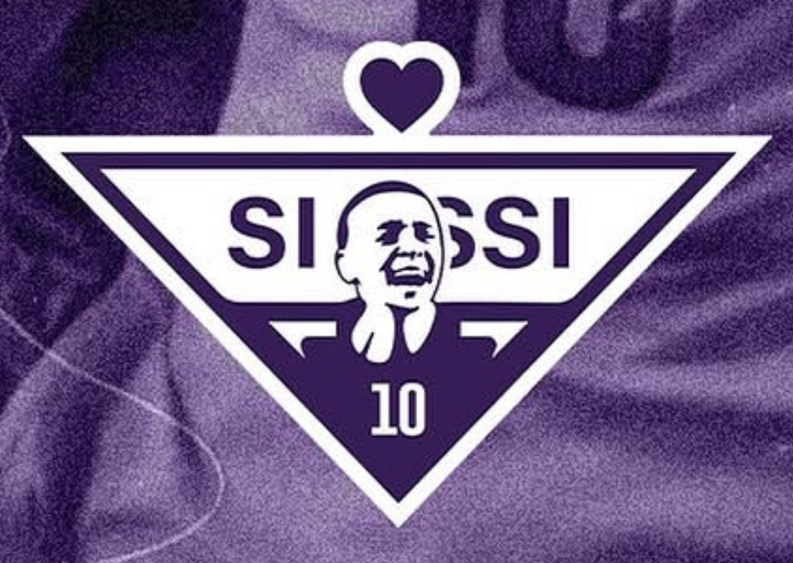

# Taça Sissi

<table align="right" width="280" style="margin-left: 20px; margin-bottom: 20px; border: 1px solid #d8dee4; border-collapse: collapse; font-family: sans-serif;">
  <thead>
    <tr style="background-color: #f6f8fa;">
      <th colspan="2" style="padding: 10px; border: 1px solid #d8dee4; text-align: center; font-size: 1.1em;">Taça Sissi</th>
    </tr>
  </thead>
  <tbody>
    <tr>
      <td colspan="2" align="center" style="text-align: center; padding: 15px; border: 1px solid #d8dee4; background-color: #ffffff;">
        
      </td>
    </tr>
    <tr>
      <td style="padding: 8px; border: 1px solid #d8dee4; font-weight: bold; background-color: #f6f8fa; width: 35%;">Organizador</td>
      <td style="padding: 8px; border: 1px solid #d8dee4; background-color: #ffffff;"><a href="../index.md">LFA</a></td>
    </tr>
    <tr>
      <td style="padding: 8px; border: 1px solid #d8dee4; font-weight: bold; background-color: #f6f8fa;">Tipo</td>
      <td style="padding: 8px; border: 1px solid #d8dee4; background-color: #ffffff;">Torneio Feminino</td>
    </tr>
    <tr>
      <td style="padding: 8px; border: 1px solid #d8dee4; font-weight: bold; background-color: #f6f8fa;">Edições</td>
      <td style="padding: 8px; border: 1px solid #d8dee4; background-color: #ffffff;">1</td>
    </tr>
    <tr>
      <td style="padding: 8px; border: 1px solid #d8dee4; font-weight: bold; background-color: #f6f8fa;">Times</td>
      <td style="padding: 8px; border: 1px solid #d8dee4; background-color: #ffffff;">4</td>
    </tr>
    <tr>
      <td style="padding: 8px; border: 1px solid #d8dee4; font-weight: bold; background-color: #f6f8fa;">Primeiro vencedor</td>
      <td style="padding: 8px; border: 1px solid #d8dee4; background-color: #ffffff;"><a href="../times/sao-bento.md">São Bento</a> (<a href="./sissi/2025-apertura.md">2025-A</a>)</td>
    </tr>
    <tr>
      <td style="padding: 8px; border: 1px solid #d8dee4; font-weight: bold; background-color: #f6f8fa;">Último vencedor</td>
      <td style="padding: 8px; border: 1px solid #d8dee4; background-color: #ffffff;"><a href="../times/sao-bento.md">São Bento</a> (<a href="./sissi/2025-apertura.md">2025-A</a>)</td>
    </tr>
    <tr>
      <td style="padding: 8px; border: 1px solid #d8dee4; font-weight: bold; background-color: #f6f8fa;">Maior vencedor</td>
      <td style="padding: 8px; border: 1px solid #d8dee4; background-color: #ffffff;"><a href="../times/sao-bento.md">São Bento</a> (1 título)</td>
    </tr>
  </tbody>
</table>

A **Taça Sissi** era o torneio feminino da [LFA](../index.md).

O nome homenageia Sisleine do Amor Lima, conhecida como Sissi. Natural de Esplanada (BA), Sissi foi uma das precursoras do futebol feminino, que permaneceu proibido no Brasil até 1979. A jogadora ganhou destaque e chegou à seleção brasileira em 1999, quando conquistou a terceira posição. Sissi, então, cumpriu sua promessa de raspar a cabeça em caso de uma boa colocação.

O que, em qualquer homem, renderia até reportagens sobre sua “ousadia”, para Sissi não aconteceu. A própria CBF fez de tudo para “esconder” a Sissi careca, evitando sua presença em entrevistas e chegando ao ponto de criar a famosa “lei da beleza” de 2001, que buscava “atrair o público masculino” com a “beleza de suas jogadoras”.

Sissi enfrentou todas as formas de machismo e sexismo. Foi impedida de jogar devido a essas regras, desfalcou seu clube na época, o São Paulo, e acabou pagando o preço por sua postura: deixou de ser convocada, perdeu oportunidades, mas, como uma verdadeira guerreira, não baixou a cabeça. Seguiu sendo ela mesma, mesmo que isso lhe tenha custado o reconhecimento por seus feitos em campo.

Por essa razão, Sissi nos inspira: por sua habilidade dentro de campo, sua coragem fora dele e a certeza de que esteve sempre do lado certo. Ela merece toda a glória que uma jogadora deve ter, pois sua luta dentro e fora de campo inspira atletas e todas as pessoas que não se calam diante de injustiças e desigualdades.

Paz entre nós, guerra aos senhores!

## Formato

O torneio é disputado em uma fase inicial de **pontos corridos**, seguida por uma fase eliminatória (**mata-mata**) para definir as campeãs.

## Histórico

| Ed. | Campeão | Placar | Vice | Terceiro | Placar | Quarto |
| :--- | :--- | :--- | :--- | :--- | :--- | :--- |
| [2025-A](./sissi/2025-apertura.md) | **[São Bento](../times/sao-bento.md)** | V x D | [Delas](../times/delas.md) | [Matriarcado](../times/matriarcado.md) | V x D | [Ginga](../times/ginga.md) |

## Desempenho por Equipe

| Equipe | Títulos | Vices | Terceiros | Quartos |
| :--- | :---: | :---: | :---: | :---: |
| [São Bento](../times/sao-bento.md) | 1 ([2025-A](./sissi/2025-apertura.md)) | 0 | 0 | 0 |
| [Delas](../times/delas.md) | 0 | 1 ([2025-A](./sissi/2025-apertura.md)) | 0 | 0 |
| [Matriarcado](../times/matriarcado.md) | 0 | 0 | 1 ([2025-A](./sissi/2025-apertura.md)) | 0 |
| [Ginga](../times/ginga.md) | 0 | 0 | 0 | 1 ([2025-A](./sissi/2025-apertura.md)) |
