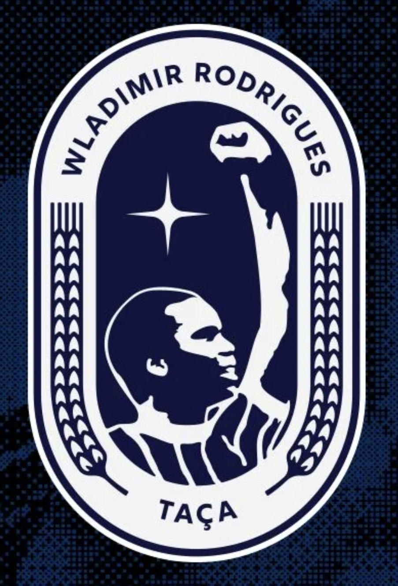

# Taça Wladimir Rodrigues 2025 – Apertura

<table align="right" width="300" style="margin-left: 20px; margin-bottom: 20px; border: 1px solid #d8dee4; border-collapse: collapse; font-family: sans-serif;">
<thead>
<tr style="background-color: #f6f8fa;">
<th colspan="2" style="padding: 10px; border: 1px solid #d8dee4; text-align: center; font-size: 1.2em;">Taça Wladimir Rodrigues 2025 <small>Apertura</small></th>
</tr>
</thead>
<tbody>
<tr>
<td colspan="2" align="center" style="text-align: center; padding: 15px; border: 1px solid #d8dee4; background-color: #ffffff;">

</td>
</tr>
<tr>
<td style="padding: 8px; border: 1px solid #d8dee4; font-weight: bold; background-color: #f6f8fa; width: 40%;">Campeão</td>
<td style="padding: 8px; border: 1px solid #d8dee4; background-color: #ffffff;"><b><a href="../../times/azulão.md">Azulão Esporte Clube</a></b> (1º título)</td>
</tr>
<tr>
<td style="padding: 8px; border: 1px solid #d8dee4; font-weight: bold; background-color: #f6f8fa;">Vice-campeão</td>
<td style="padding: 8px; border: 1px solid #d8dee4; background-color: #ffffff;"><a href="../../times/toque-de-classe.md">Toque de Classe AD</a></td>
</tr>
<tr>
<td style="padding: 8px; border: 1px solid #d8dee4; font-weight: bold; background-color: #f6f8fa;">Terceiro lugar</td>
<td style="padding: 8px; border: 1px solid #d8dee4; background-color: #ffffff;"><a href="../../times/matsubara.md">Matsubara Esporte Clube</a></td>
</tr>
<tr>
<td style="padding: 8px; border: 1px solid #d8dee4; font-weight: bold; background-color: #f6f8fa;">Quarto lugar</td>
<td style="padding: 8px; border: 1px solid #d8dee4; background-color: #ffffff;"><a href="../../times/zapatista.md">Clube Atletico Zapatista</a></td>
</tr>
<tr style="background-color: #f6f8fa;">
<th colspan="2" style="padding: 6px; border: 1px solid #d8dee4; text-align: center; font-size: 0.95em;">Estatísticas</th>
</tr>
<tr>
<td style="padding: 8px; border: 1px solid #d8dee4; font-weight: bold; background-color: #f6f8fa;">Partidas jogadas</td>
<td style="padding: 8px; border: 1px solid #d8dee4; background-color: #ffffff;">34</td>
</tr>
<tr>
<td style="padding: 8px; border: 1px solid #d8dee4; font-weight: bold; background-color: #f6f8fa;">Gols marcados</td>
<td style="padding: 8px; border: 1px solid #d8dee4; background-color: #ffffff;">230 (6.76 por partida)</td>
</tr>
<tr>
<td style="padding: 8px; border: 1px solid #d8dee4; font-weight: bold; background-color: #f6f8fa;">Artilheiro</td>
<td style="padding: 8px; border: 1px solid #d8dee4; background-color: #ffffff;">Bryan (17 gols)</td>
</tr>
</tbody>
</table>

A **Taça Wladimir Rodrigues de 2025 – Apertura** foi a 1ª edição do campeonato de segunda divisão da LFA (Liga de Futebol Antifascista).

O **Azulão Esporte Clube** sagrou-se campeão do torneio após empatar com o **Toque de Classe AD** por 0 a 0 e vencer por 2 a 0 nas penalidades máximas.

## Primeira Fase

| Pos | Equipe | P | J | V | E | D | GP | GC | SG | % | PE |
| :---: | :--- | :---: | :---: | :---: | :---: | :---: | :---: | :---: | :---: | :---: | :---: |
| 1 | [Azulão Esporte Clube](../../times/azulão.md) | **15** | 5 | 5 | 0 | 0 | 41 | 11 | +30 | 100% | 0 |
| 2 | [Toque de Classe AD](../../times/toque-de-classe.md) | **10** | 5 | 3 | 1 | 1 | 22 | 16 | +6 | 67% | 0 |
| 3 | [Clube Atletico Zapatista](../../times/zapatista.md) | **7** | 5 | 2 | 1 | 2 | 13 | 18 | -5 | 47% | 0 |
| 4 | [Bolchesítio Futebol Clube](../../times/bolchesitio.md) | **6** | 5 | 2 | 0 | 3 | 16 | 21 | -5 | 40% | 0 |
| 5 | [Matsubara Esporte Clube](../../times/matsubara.md) | **3** | 5 | 1 | 0 | 4 | 10 | 22 | -12 | 20% | 0 |
| 6 | [FC ST. Paulo Freire](../../times/paulo-freire.md) | **3** | 5 | 1 | 0 | 4 | 16 | 30 | -14 | 20% | 0 |

## Segunda Fase

| Pos | Equipe | P | J | V | E | D | GP | GC | SG | % | PE |
| :---: | :--- | :---: | :---: | :---: | :---: | :---: | :---: | :---: | :---: | :---: | :---: |
| 1 | [Toque de Classe AD](../../times/toque-de-classe.md) | **11** | 5 | 3 | 2 | 0 | 18 | 15 | +3 | 73% | 0 |
| 2 | [Matsubara Esporte Clube](../../times/matsubara.md) | **10** | 5 | 3 | 1 | 1 | 16 | 11 | +5 | 67% | 0 |
| 3 | [Azulão Esporte Clube](../../times/azulão.md) | **9** | 5 | 3 | 0 | 2 | 24 | 16 | +8 | 60% | 0 |
| 4 | [FC ST. Paulo Freire](../../times/paulo-freire.md) | **5** | 5 | 1 | 2 | 2 | 11 | 16 | -5 | 33% | 0 |
| 5 | [Bolchesítio Futebol Clube](../../times/bolchesitio.md) | **4** | 5 | 1 | 1 | 3 | 13 | 19 | -6 | 27% | 0 |
| 6 | [Clube Atletico Zapatista](../../times/zapatista.md) | **3** | 5 | 1 | 0 | 4 | 16 | 21 | -5 | 20% | 0 |

## Classificação Geral (Acumulada)

| Pos | Equipe | P | J | V | E | D | GP | GC | SG | % | PE |
| :---: | :--- | :---: | :---: | :---: | :---: | :---: | :---: | :---: | :---: | :---: | :---: |
| 1 | [Azulão Esporte Clube](../../times/azulão.md) | **30** | 12 | 10 | 0 | 2 | 71 | 29 | +42 | 83% | 0 |
| 2 | [Toque de Classe AD](../../times/toque-de-classe.md) | **22** | 12 | 6 | 4 | 2 | 45 | 37 | +8 | 61% | 0 |
| 3 | [Matsubara Esporte Clube](../../times/matsubara.md) | **17** | 12 | 5 | 2 | 5 | 33 | 38 | -5 | 47% | 0 |
| 4 | [Clube Atletico Zapatista](../../times/zapatista.md) | **16** | 12 | 5 | 1 | 6 | 38 | 44 | -6 | 44% | 0 |
| 5 | [Bolchesítio Futebol Clube](../../times/bolchesitio.md) | **10** | 12 | 3 | 1 | 8 | 34 | 49 | -15 | 28% | 0 |
| 6 | [FC ST. Paulo Freire](../../times/paulo-freire.md) | **8** | 12 | 2 | 2 | 8 | 29 | 53 | -24 | 22% | 0 |

## Fase Final

<table border="0" cellpadding="0" cellspacing="0" style="border-collapse: collapse; width: 100%;">
<tr>
<th style="width: 45%; text-align: center; padding-bottom: 10px;">Semifinais</th>
<th style="width: 10%;"></th>
<th style="width: 45%; text-align: center; padding-bottom: 10px;">Final</th>
</tr>
<tr>
<td style="vertical-align: middle; padding: 10px;">
<table style="border: 1px solid #d8dee4; width: 100%; margin-bottom: 25px; border-collapse: collapse;">
<tr>
<td style="padding: 8px; border: 1px solid #d8dee4;"><b><a href="../../times/toque-de-classe.md">Toque de Classe AD</a></b></td>
<td style="padding: 8px; border: 1px solid #d8dee4; text-align: center; width: 40px; font-weight: bold;">6</td>
</tr>
<tr>
<td style="padding: 8px; border: 1px solid #d8dee4;"><a href="../../times/zapatista.md">Clube Atletico Zapatista</a></td>
<td style="padding: 8px; border: 1px solid #d8dee4; text-align: center; width: 40px;">4</td>
</tr>
</table>
<table style="border: 1px solid #d8dee4; width: 100%; border-collapse: collapse;">
<tr>
<td style="padding: 8px; border: 1px solid #d8dee4;"><b><a href="../../times/azulão.md">Azulão Esporte Clube</a></b></td>
<td style="padding: 8px; border: 1px solid #d8dee4; text-align: center; width: 40px; font-weight: bold;">3</td>
</tr>
<tr>
<td style="padding: 8px; border: 1px solid #d8dee4;"><a href="../../times/matsubara.md">Matsubara Esporte Clube</a></td>
<td style="padding: 8px; border: 1px solid #d8dee4; text-align: center; width: 40px;">1</td>
</tr>
</table>
</td>
<td></td>
<td style="vertical-align: middle; padding: 10px;">
<table style="border: 2px solid #333; width: 100%; border-collapse: collapse;">
<tr style="background-color: #f6f8fa;">
<th colspan="2" style="padding: 10px; text-align: center; border-bottom: 2px solid #333;">FINAL</th>
</tr>
<tr>
<td style="padding: 8px; border: 1px solid #d8dee4;"><b><a href="../../times/azulão.md">Azulão Esporte Clube</a></b></td>
<td style="padding: 8px; border: 1px solid #d8dee4; text-align: center; width: 60px; font-weight: bold; background-color: #e6ffec;">0 (2 p)</td>
</tr>
<tr>
<td style="padding: 8px; border: 1px solid #d8dee4;"><a href="../../times/toque-de-classe.md">Toque de Classe AD</a></td>
<td style="padding: 8px; border: 1px solid #d8dee4; text-align: center; width: 60px; font-weight: bold;">0 (0 p)</td>
</tr>
</table>
</td>
</tr>
</table>

<h3>Disputa pelo 3º lugar</h3>
<table style="border: 1px solid #d8dee4; width: 320px; border-collapse: collapse; margin-top: 15px;">
<tr>
<td style="padding: 8px; border: 1px solid #d8dee4;"><b><a href="../../times/matsubara.md">Matsubara Esporte Clube</a></b></td>
<td style="padding: 8px; border: 1px solid #d8dee4; text-align: center; width: 60px; font-weight: bold; background-color: #e6ffec;">0 (5 p)</td>
</tr>
<tr>
<td style="padding: 8px; border: 1px solid #d8dee4;"><a href="../../times/zapatista.md">Clube Atletico Zapatista</a></td>
<td style="padding: 8px; border: 1px solid #d8dee4; text-align: center; width: 60px; font-weight: bold;">0 (4 p)</td>
</tr>
</table>

## Artilharia

| Pos | Jogador | Equipe | Gols |
| :---: | :--- | :--- | :---: |
| 1 | Bryan | [Toque de Classe AD](../../times/toque-de-classe.md) | 17 |
| 2 | Pedroso | [Azulão Esporte Clube](../../times/azulão.md) | 13 |
| 3 | Thalian | [Azulão Esporte Clube](../../times/azulão.md) | 11 |
| 4 | Kevvy | [Azulão Esporte Clube](../../times/azulão.md) | 11 |
| 5 | Vinicius Ribeiro | [Toque de Classe AD](../../times/toque-de-classe.md) | 10 |
| 6 | João Victor | [Clube Atletico Zapatista](../../times/zapatista.md) | 8 |
| 7 | Thiaguinho | [Toque de Classe AD](../../times/toque-de-classe.md) | 7 |
| 8 | Martielo | [Clube Atletico Zapatista](../../times/zapatista.md) | 7 |
| 9 | Max | [Toque de Classe AD](../../times/toque-de-classe.md) | 7 |
| 10 | EDUARDO | [Azulão Esporte Clube](../../times/azulão.md) | 7 |
