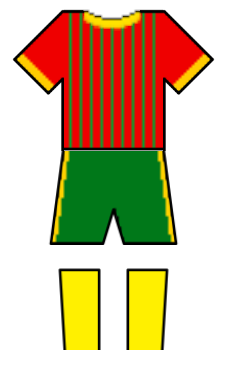

# Umbabarauma Fut & Arte

<table align="right" width="280" style="margin-left: 20px; margin-bottom: 20px; border: 1px solid #d8dee4; border-collapse: collapse; font-family: sans-serif;">
  <thead>
    <tr style="background-color: #f6f8fa;">
      <th colspan="2" style="padding: 10px; border: 1px solid #d8dee4; text-align: center; font-size: 1.1em;">Umbabarauma Fut & Arte</th>
    </tr>
  </thead>
  <tbody>
    <tr>
      <td colspan="2" align="center" style="text-align: center; padding: 15px; border: 1px solid #d8dee4; background-color: #ffffff;">
        
      </td>
    </tr>
    <tr>
      <td style="padding: 8px; border: 1px solid #d8dee4; font-weight: bold; background-color: #f6f8fa; width: 35%;">Nome completo</td>
      <td style="padding: 8px; border: 1px solid #d8dee4; background-color: #ffffff;">Umbabarauma Fut & Arte</td>
    </tr>
    <tr>
      <td style="padding: 8px; border: 1px solid #d8dee4; font-weight: bold; background-color: #f6f8fa;">Fundação</td>
      <td style="padding: 8px; border: 1px solid #d8dee4; background-color: #ffffff;">2022</td>
    </tr>
    <tr>
      <td colspan="2" align="center" style="padding: 15px; border: 1px solid #d8dee4; background-color: #ffffff;">
        

          <strong style="display: block; margin-bottom: 5px;">Uniforme titular</strong>
          

            
          

        

      </td>
    </tr>
  </tbody>
</table>

Nascido em 2022 de forma despretensiosa pela iniciativa de Luam Clarindo ao convocar amigos para a pelada. Sem alcunha definida até então o time foi se desenvolvendo e passando por várias fases. Atualmente o "Umbabarauma" une duas fortes características tupiniquins: a fome de bola e o talento musical.

Alquimistas da bola, feiticeiros de Santa Kaya e a Deusa música um dia abençoaram Ad Eternum essa seleção de feras, que é composta em quase sua totalidade por toda sorte de músicos e artistas de diferentes lugares do Brasil, que por sincronicidade vivem atualmente aqui na terra das araucárias. Já conhecido também como THssoCer, THChute e outras denominações, a lenda do ponta de lança africano inspira hoje o "Umbabarauma" na busca de sua primeira taça!!

## Títulos

### Campeão
* [Taça Wladimir Rodrigues](../campeonatos/taca-wladimir-rodrigues.md): 1 ([2026-A](../temporadas/2026/apertura.md))

### Campanhas de Destaque
* **Vice-campeão**:
  * [Copa Carlos Caszely](../campeonatos/copa-carlos-caszely.md): 1 ([2026-A](../temporadas/2026/apertura.md))
* **Terceiro lugar**:
  * [Copa Eric Cantona](../campeonatos/copa-eric-cantona.md): 1 ([2023-A](../temporadas/2023/apertura.md))
  * [Copa Carlos Caszely](../campeonatos/copa-carlos-caszely.md): 1 ([2025-C](../temporadas/2025/clausura.md))
  * [Taça Cecília](../campeonatos/taca-cecilia.md): 1 ([2024-C](../temporadas/2024/clausura.md))

## Elenco Atual

| N | Pos. | Nome |
| :---: | :---: | :--- |
| 12 | G | Wainer |
| 1 | G | Ochoa |
| 5 | Z | Rafa Marques |
| 3 | Z | Matheus Ximendes |
| 21 | Z | Alisson |
| 14 | ? | Kasai |
| 24 | L | Matheus Bahia |
| 6 | M | Ander |
| 10 | M | Renan |
| 8 | M | Titos |
| 20 | Z | Helton |
| - | ? | Gui |
| 13 | L | James |
| 11 | L | Dalton |
| 2 | ? | Felipe |
| - | A | Luizão |
| 7 | A | Triska |
| 19 | A | André Soneka |
| - | Z | Thomas |
| - | ? | Wesley |
